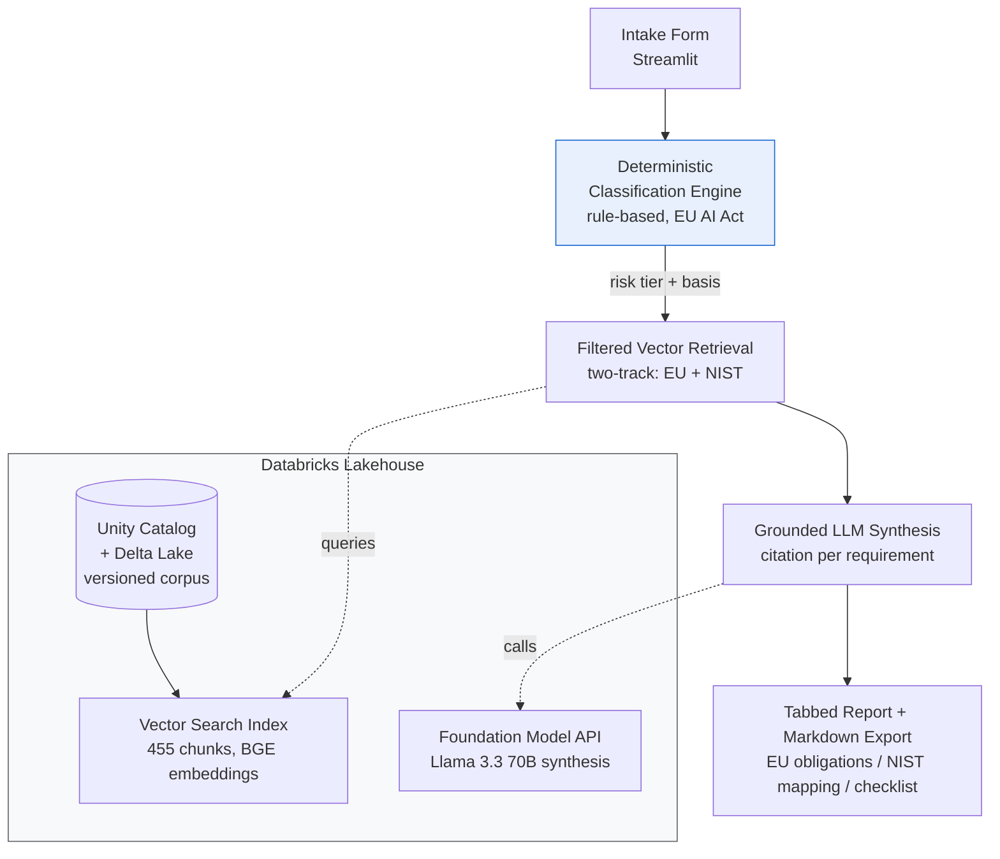

# ⚖️ AI Compliance Navigator

**A RAG-powered regulatory mapping tool for the EU AI Act and NIST AI RMF, built on Databricks.**

Describe an AI system in plain terms and get a structured, cited compliance report: its EU AI Act risk classification, the specific obligations that follow, a NIST AI RMF mapping, and a cross-framework checklist — every requirement traceable to a source provision.

> ⚠️ **Disclaimer:** This tool provides regulatory mapping for informational purposes only. It does not constitute legal advice. Consult qualified legal counsel for compliance determinations.

**Live demo:** _[deployed URL — coming soon]_
**Built by:** Aryaveer Singh · [GitHub](https://github.com/singhgolf89-ai) · [LinkedIn](https://www.linkedin.com/in/aryaveersingh/)

---

## The problem

In AI governance work, regulatory mapping is the most time-consuming task: determining which EU AI Act provisions apply to a given system, and how to implement controls. This tool accelerates that mapping — turning a system description into a first-pass, citation-backed compliance assessment for review by qualified counsel.

## The core design decision

**The compliance determination is deterministic and auditable; the LLM only retrieves and synthesizes — it never classifies.**

Risk classification (Prohibited / High-Risk / Limited / Minimal) is done by a rule-based engine that maps a system's characteristics to specific EU AI Act articles and Annex III categories. The same input always yields the same output, with a traceable rule behind every decision. The LLM's job is narrower: given the retrieved regulatory text, synthesize the obligations that *follow from* the classification, citing each one. This separation is what makes the output defensible — the classifier is reproducible, and the LLM is grounded in retrieved sources rather than answering from memory.

## Architecture



**Pipeline:** intake → deterministic classification → source-filtered vector retrieval (EU AI Act and NIST retrieved separately, EU filtered by risk tier) → grounded LLM synthesis with a citation for every requirement → tabbed report with Markdown export.

## Tech stack

| Layer | Choice | Why |
|---|---|---|
| Data governance | Unity Catalog + Delta Lake (Change Data Feed) | Versioned, auditable regulatory corpus — provable which text version produced any report |
| Chunking | Domain-specific (EU by article/annex, NIST by subcategory) | Preserves regulatory structure; retrieval units match how the law is cited |
| Embeddings | Databricks BGE (`bge-large-en`, 1024-dim) | Cost-effective, high-quality for regulatory text |
| Retrieval | Databricks Vector Search (Delta Sync index) | Native integration; source + risk-tier filtering |
| Classification | Rule-based engine (Python) | Auditability and determinism — non-negotiable for compliance tooling |
| Synthesis | Databricks-hosted Llama 3.3 70B | Grounded, cited JSON output; all-Databricks, no external keys |
| Frontend | Streamlit | Fastest path to a demoable UI |

## Honest engineering notes

Two deliberate, interview-relevant choices:

**1. Open model instead of managed Claude.** The design targets a Databricks-hosted Claude endpoint for synthesis. My Databricks Free Edition tenant does not expose pay-per-token Claude (Anthropic FM APIs are tier/region-gated), so the MVP uses Databricks-hosted **Llama 3.3 70B** instead — reachable, capable, and fully internal to Databricks with no external API keys. On an entitled workspace this is a one-line swap (`LLM_ENDPOINT` in `src/utils.py`). Open-model JSON is slightly looser than Claude's, so synthesis includes a defensive JSON parser (fence-strip + brace-clip) and low temperature — verified to produce schema-valid output across consecutive runs.

**2. Demo-mode fallback for the public deployment.** The deployed app authenticates to Databricks with a personal token. To keep the public URL free, always-on, and safe from quota drain, the deployed app runs in demo mode: the **deterministic classifier still runs live** on every input, while the LLM-synthesized report is served from a pre-generated real sample (`data/sample_report.json`) rather than a live backend call. Run locally with Databricks credentials for full live synthesis. This keeps the shareable link bulletproof while the code demonstrates the complete live integration.

## Test evidence

A 10-scenario suite (`tests/test_scenarios.json`) exercises all four risk tiers and edge cases, including:
- **Rule ordering:** emotion recognition in the workplace classifies as *Prohibited* (Art. 5(1)(f)), not High-Risk — prohibited practices are evaluated before high-risk.
- **Multi-category match:** a biometric + insurance system resolves to its first matching Annex III category deterministically.
- **Grounding / no invention:** fed empty retrieval, the synthesis layer returns "not addressed in retrieved sources" rather than fabricating citations (verified).

```bash
python tests/test_classification.py   # 4 unit tests + 10-scenario suite
```

## Regulatory currency

EU AI Act dates reflect Regulation (EU) 2024/1689, Article 113 (current published law): prohibited practices from 2 February 2025; general application, including high-risk (Annex III) and transparency (Art. 50), from 2 August 2026. A *Digital Omnibus* amendment under EU negotiation could shift some high-risk dates if adopted — the tool cites provisions and flags dates for counsel verification rather than asserting them as immutable.

## Running locally

```bash
# 1. Clone and install
git clone https://github.com/singhgolf89-ai/ai-compliance-navigator.git
cd ai-compliance-navigator
pip install -r requirements.txt

# 2. Add Databricks credentials for live analysis
#    Create .streamlit/secrets.toml (gitignored):
#    [databricks]
#    host = "https://your-workspace.cloud.databricks.com"
#    token = "dapi..."

# 3. Run
streamlit run app.py
```

Backend setup (corpus ingestion, vector index, endpoints) lives in `notebooks/` — run in a Databricks workspace. See `architecture.md` for the full design.

## Roadmap (v2)

- Dedicated GPAI classification (Art. 51–56) — MVP surfaces GPAI transparency obligations but not the full GPAI regime
- Broader Insurance/Financial-Services corpus (GDPR, GLBA, DORA, SR 11-7, NAIC, Colorado SB 21-169, NYDFS, ECOA/FCRA)
- Assessment audit log: persist every intake + classification to a versioned Delta table (closes the audit loop)
- ISO/IEC 42001 mapping; interactive follow-up questioning; PDF export
- Retrieval ranking tuning (NIST subcategory relevance)

---

*Informational only; not legal advice. Built as a portfolio project.*