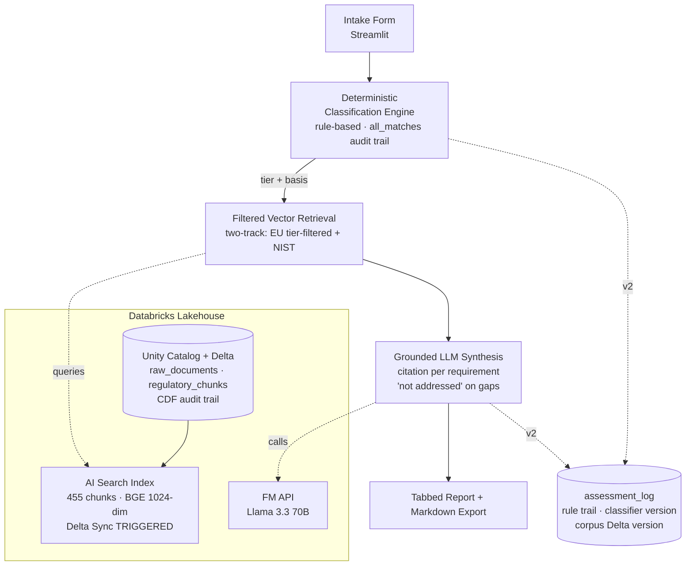

# AI Compliance Navigator — Databricks Architecture (v2.0)

## A RAG-powered regulatory mapping tool for the EU AI Act and NIST AI RMF

**Built by:** Aryaveer Singh
**Stack:** Databricks Lakehouse + Unity Catalog + AI Search (Vector Search) + Foundation Model APIs + Streamlit
**Status:** v1 MVP shipped and publicly deployed · v2 in build (see `docs/v2_build_plan.md`)

---

## Document purpose and how to read it

This document supersedes v1.0. It serves two jobs at once:

1. **As-built record of v1** — what actually shipped, including every place reality diverged from the v1.0 design (LLM choice, product renames, verified regulatory dates, deployment model). Divergences are marked **[As-built]**.
2. **Target architecture for v2** — the audit spine, authentication, assessment history, evaluation harness, GPAI overlay, and the live-lite public tier. New components are marked **[v2]**.

The companion `docs/v2_build_plan.md` holds the phased plan with Definition-of-Done gates; this document holds the *what and why*. The repository itself is the authoritative source for code — this document describes components and points to files rather than duplicating implementations.

---

## Executive Summary

The AI Compliance Navigator turns a plain-language description of an AI system into a structured, cited compliance report: an EU AI Act risk classification, the specific obligations that follow, a NIST AI RMF mapping, and a cross-framework checklist.

The load-bearing design decision, unchanged from v1.0 and now empirically validated: **the compliance determination is deterministic and auditable; the LLM only retrieves and synthesizes — it never classifies.** v1 proved the grounding property under test (starved retrieval produces zero invented citations). v2 extends the same philosophy inward: the tool that makes auditable determinations becomes accountable for itself, logging every assessment with its rule trail, ruleset version, and the exact corpus version behind it — reproducible via Delta time travel.

---

## Scope evolution

| | v1 (shipped) | v2 (in build) | v3+ (backlog) |
|---|---|---|---|
| Classification | 4-tier deterministic engine, `all_matches` audit field | GPAI overlay (Art. 51–56, `is_gpai` flag) | — |
| Corpus | EU AI Act + NIST AI RMF + Playbook (455 chunks) | unchanged | +1 FS framework (Colorado SB 21-169 or NYDFS 500); broader FS stack; ISO 42001 (blocked: paywalled text) |
| Retrieval | Two-track filtered vector search (managed) | + in-process local retrieval for public tier | reranking / hybrid search |
| Synthesis | Llama 3.3 70B, cited JSON, defensive parser | + capped-key provider path for public tier | LLM-as-judge quality layer |
| Persistence | none (stateless, by design) | `assessment_log` audit table + history UI + re-run diff | — |
| Auth | none (public) / PAT (local) | `st.login` Google, pseudonymous `user_id` | service principal, roles |
| Eval | 10-scenario suite + 3 synthesis gates | golden-set retrieval metrics in MLflow | golden-set expansion, judge models |
| Export | Markdown | unchanged | PDF |
| Interaction | single-shot form | unchanged | follow-up questioning (refines intake fields only — never the tier) |

---

## Databricks Architecture Overview

### Why Databricks — updated with tier reality **[As-built]**

| Capability | Benefit | Free Edition reality (verified during build) |
|---|---|---|
| Unity Catalog | Governed, versioned regulatory corpus | Full support; catalog/schema/volume creation works |
| AI Search (formerly Vector Search) | Native retrieval, source/tier filtering | DELTA_SYNC supported; quota of 1 endpoint; provisioning is throttled (~15 min) |
| Foundation Model APIs — embeddings | `databricks-bge-large-en` (1024-dim) | Available and verified |
| Foundation Model APIs — LLMs | Managed Claude for synthesis | **Not available** on Free Edition (pay-per-token Claude gated); Databricks-hosted OSS models are |
| Delta Lake + Change Data Feed | Audit trail; time-travel reproducibility | Full support; CDF is *required* on any Delta Sync source table |
| MLflow | Experiment tracking | Managed tracking available in-workspace |
| Databricks Apps | Enterprise hosting path | Unreliable on Free Edition; deferred to the paid-workspace decision gate |

### Core pipeline



### Deployment topologies **[As-built + v2]**

One codebase, three run modes selected by configuration — the mechanism that keeps the public URL bulletproof while the full live integration remains demonstrable:

| Mode | Classifier | Retrieval | Synthesis | Where it runs | Purpose |
|---|---|---|---|---|---|
| **Local live** | in-process | Databricks AI Search (PAT) | Databricks Llama 3.3 70B (PAT) | developer laptop | full live demo; the enterprise path |
| **Public live** | in-process | Databricks (scoped cloud PAT) | Databricks (scoped cloud PAT) | Streamlit Community Cloud | live public analysis; graceful fallback to sample on backend failure |
| **Public demo** (`DEMO_MODE=true`) | in-process (always live) | none | pre-generated real sample (`data/sample_report.json`) | Streamlit Community Cloud | zero-backend, zero-cost, always-on |
| **Public live-lite** **[v2]** | in-process | in-process (`bge-small` local embeddings, same-model corpus+query) | provider API, **hard $5 cap** | Streamlit Community Cloud | live analysis with zero Databricks dependency and bounded cost |

Design invariant across all modes: **the deterministic classifier always runs live, in-process.** Only retrieval and synthesis vary by tier.

---

## Component Implementation Details

### 1. Data layer — Unity Catalog + Delta Lake **[As-built]**

Canonical objects (all shipped):

- Catalog/schema: `ai_governance.compliance_navigator`
- Volume: `raw_docs` (source PDFs, uploaded via Catalog Explorer)
- `raw_documents` — one row per source document, **CDF enabled** (audit trail on the corpus itself)
- `regulatory_chunks` — the vector-search source table; **CDF enabled** (added post-v1.0: Delta Sync *requires* it)
- `framework_mappings` — pre-computed EU↔NIST crosswalk (`data/framework_mappings.json` is the seed)

Chunk metadata (as v1.0 designed, proven in retrieval): `document_section`, `section_title`, `risk_tier`, `applicable_role`, `compliance_deadline` (verified strings — see Regulatory Currency), `framework_function` / `category_id` / `subcategory_id` for NIST, deterministic `chunk_id` (`source:section_slug:index`) giving idempotent reloads and stable citation keys.

**[v2] Table 4: Assessment audit log.** The v2 centerpiece — every determination the tool makes becomes queryable and reproducible:

```sql
CREATE TABLE ai_governance.compliance_navigator.assessment_log (
    assessment_id        STRING NOT NULL,     -- UUID
    created_at           TIMESTAMP,
    user_id              STRING,              -- stable auth subject (st.login), never raw email
    session_id           STRING,
    app_version          STRING,
    demo_mode            BOOLEAN,

    intake               STRING,              -- full SystemIntake JSON
    system_name          STRING,
    domain               STRING,

    risk_tier            STRING,
    primary_basis        STRING,
    applicable_role      STRING,
    compliance_deadline  STRING,
    confidence           STRING,
    all_matches          ARRAY<STRING>,       -- every rule that fired: the determination's audit trail
    classifier_version   STRING,              -- which ruleset produced this

    retrieval_query      STRING,
    eu_chunk_ids         ARRAY<STRING>,
    nist_chunk_ids       ARRAY<STRING>,
    corpus_table_version BIGINT,              -- Delta version of regulatory_chunks → time-travel reproducibility
    embedding_endpoint   STRING,

    llm_endpoint         STRING,
    llm_temperature      DOUBLE,
    report               STRING,              -- full synthesized JSON
    synthesis_status     STRING,              -- ok | parse_error | fallback (failures are logged too)
    latency_ms           BIGINT,

    CONSTRAINT assessment_log_pk PRIMARY KEY (assessment_id)
) USING DELTA
TBLPROPERTIES ('delta.enableChangeDataFeed' = 'true');
```

Deliberate exclusions (privacy by design, data minimization): no IP addresses, no device fingerprints, no raw email in the log, no retrieved chunk *text* (chunk IDs + `corpus_table_version` reconstruct it via time travel). Erasure runbook: right-to-erasure = `DELETE` **plus** `VACUUM` past the retention window — Delta time travel retains deleted rows until then. Write path: `databricks-sql-connector` → serverless SQL warehouse, `sql`-scoped PAT. Logging is deliberately scoped to modes with a governed backend (local live / public live); live-lite public traffic is measured by platform analytics instead.

### 2. Ingestion + chunking **[As-built — two deviations from v1.0, both load-bearing]**

`notebooks/01_document_ingestion.py`. Sources from official origins only (EUR-Lex Reg. 2024/1689; NIST AI 100-1; NIST AIRC Playbook).

- **Extraction: PyMuPDF, not pypdf.** EUR-Lex's letter-spaced typography caused pypdf to inject intra-word spaces ("Ar ticle"), defeating all structural parsing. PyMuPDF reconstructs words correctly; `clean_text` additionally normalizes the structural tokens the chunkers key on. Lesson institutionalized: extraction fidelity is a first-class engineering decision. (Note: PyMuPDF is AGPL — acceptable for this open repo.)
- **Hardened, structure-aware chunking.** EU: split only on *validated* article headings — short line, `Article N` pattern, **monotonically increasing article numbers** — so inline cross-references ("…referred to in Article 6(1)…") cannot fragment chunks. Annexes chunked separately (v1.0 omitted them; Annex III is the high-risk list and must be retrievable). NIST: subcategory-ID split keeping the *longest span per ID* (defeats ToC and cross-reference noise).
- Corpus as shipped: **455 chunks** — EU 185 (124 sections = 113 articles + annexes), NIST RMF 85 (all 72 subcategories), Playbook 185 (same 72, independently reproduced — cross-validating both parses).

### 3. Embeddings + AI Search index **[As-built]**

`notebooks/02_create_vector_index.py`. Product rename noted: **Vector Search → AI Search**; SDK `databricks-vectorsearch` → `databricks-ai-search` (migration is a v2 Phase 5 item; the old import re-exports meanwhile).

- Endpoint: `compliance-navigator-endpoint` (STANDARD) — created from code, not the UI, so the repo is the source of truth. One endpoint (free-tier quota = 1, and one is all this needs).
- Index: `ai_governance.compliance_navigator.regulatory_chunks_index` — **single Delta Sync index** over `regulatory_chunks` with managed `databricks-bge-large-en` embeddings (1024-dim), `TRIGGERED` pipeline, PK `chunk_id`. *(v1.0 sketched two indexes, one per framework; as-built uses one index with source filtering — cheaper, simpler, and filtering does the same job.)*
- Operational learnings baked into the notebook: readiness is polled via `describe()` (the SDK's `wait_until_ready` signature drifted to `timedelta`); an interrupted first sync leaves an index that "exists but is not ready" — the only repair is delete + recreate; Free Edition throttles pipeline provisioning (~15 min is normal).

### 4. Classification engine **[As-built + v2 overlay]**

`src/classification_engine.py`. Deterministic, rule-based, mirroring the Act's own evaluation order: **Article 5 (prohibited) → Article 6/Annex III (high-risk) → Article 50 (transparency) → minimal.** Ordering is proven by test S5: workplace emotion recognition classifies *prohibited*, not high-risk, because prohibited is checked first.

- Output (`ClassificationResult`): tier, `primary_basis` (article/annex citation), applicable articles, role, verified deadline string, reasoning, confidence, and **`all_matches`** — every rule that fired, not just the winner. That field is the determination's own audit trail and feeds `assessment_log` in v2.
- **[v2] GPAI overlay.** GPAI (Art. 51–56) is a parallel regime, not a fifth tier — a GPAI system still has a use-case tier. Modeled as `is_gpai: bool` + `gpai_articles: list` on the result (2 August 2025 applicability; systemic-risk threshold documented as a sub-case). Preserves the four-tier enum and is the legally correct shape. Upgrades test S10 from documented-edge-case to hard assertion.
- `CLASSIFIER_VERSION` **[v2]** constant in `src/utils.py`, stamped on every logged assessment — "which version of the rules made this determination" is the question a real audit asks.

### 5. Retrieval **[As-built + v2 local variant]**

`src/retrieval.py` — **two-track filtered retrieval**, a design forced by evidence: a blind mixed query buries the on-point EU provisions under NIST vocabulary. As built: one query filtered `source=eu_ai_act` **and** `risk_tier ∈ {tier, 'all'}`; a second filtered to the NIST sources. Query construction is deliberately rich (description + tier + intent keywords) — terse queries rank procedural articles above substantive ones. Verified: "insurance creditworthiness" surfaces Articles 6/8/9/12 at `high_risk`; the tier filter never leaks forbidden tiers.

**[v2] `src/retrieval_local.py`** — same interface, selected by `PUBLIC_RETRIEVAL` config, backing the live-lite tier: 455 chunks re-embedded once with `bge-small-en-v1.5` (384-dim) via `scripts/embed_corpus_local.py`, shipped as `data/corpus_embeddings.npz` + metadata; query embedded at runtime with the *same local model*. The consistency rule (index-time and query-time embeddings must share one model) is preserved *within* each tier; the local 384-dim space is independent of the managed 1024-dim index, which remains the entitled-workspace path.

### 6. LLM synthesis **[As-built — the largest deviation from v1.0]**

`src/llm_synthesis.py`. v1.0 specified Claude via an external Model Serving endpoint. **As built: Free Edition exposes no pay-per-token Claude** (verified empirically: 404s and a "rate limit of 0"), so synthesis runs on Databricks-hosted **`databricks-meta-llama-3-3-70b-instruct`** (fallback `llama-3-1-8b`) — fully internal, no external keys, one-line swap to Claude on an entitled workspace via `LLM_ENDPOINT`.

Grounding guarantees, all test-verified:
- System prompt derived from the compliance-instructions persona, scoped to the EU+NIST corpus: ground only in provided chunks; cite every requirement (`[EU AI Act Art. X]` / `[NIST AI RMF FUNCTION X.Y]`); on gaps, emit exactly *"Not addressed in retrieved sources — manual review recommended"*; never re-classify (the tier is input, not output); plain-language explanation included.
- Low temperature (0.1) + `_extract_json` defensive parser (fence-strip, brace-clip) for open-model output → **schema-valid JSON 3/3 consecutive runs**.
- **Starved-retrieval test: fed empty context, the model invented zero articles** — every ungroundable field carried the "not addressed" sentence. The no-invention property is empirical, not aspirational.
- **[v2]** a provider-API call path with a hard $5 spend cap serves the live-lite tier behind the same function signature.

### 7. Frontend, auth, and secrets **[As-built + v2]**

`app.py` (Streamlit). Intake form covering all `SystemIntake` fields → classification (instant, in-process) → spinner → tabbed report (EU obligations as expandable cited rows / NIST mapping / cross-framework checklist table / Export) → Markdown download. Disclaimer persistent in sidebar and embedded in every export. Errors degrade gracefully: empty-form validation; backend failure serves the sample report with a warning banner — stack traces never reach the UI.

Secrets model:
- Local: `.streamlit/secrets.toml` (gitignored, verified by `git check-ignore`) holding host + PAT scoped to **model-serving + vector-search only**.
- Cloud: Streamlit secrets manager; a *separate* `streamlit-cloud` PAT (per-surface tokens → independent revocation). `DEMO_MODE` flag selects the topology. PAT expiry (~90 days) silently degrades the app to fallback-sample — a calendar reminder is part of the runbook.
- **[v2]** `st.login` (Google): `user_id` = stable subject identifier; raw email never enters the audit log; one-line privacy notice in the sidebar. The enterprise path — workspace-identity auth via Databricks Apps — is documented, not built, pending the paid-workspace gate.

### 8. Evaluation **[As-built + v2]**

As built (`tests/`): 4 unit tests + a **10-scenario suite** (`test_scenarios.json`, S1–S10) spanning all four tiers and the edge cases that matter — rule ordering (S5), multi-category first-match resolution (S9), minimal-risk fall-through (S8), GPAI documented limitation (S10, becomes an assertion in v2). Synthesis gates: schema validity ×3, 100% citation coverage, starved-retrieval no-invention.

**[v2]** Golden-set retrieval eval (`tests/golden_set.json`, 12–15 systems with expert-expected articles/subcategories; `notebooks/04_golden_eval.py`): hit-rate@k per track + citation coverage, runs logged to managed MLflow, baseline + at least one tuning iteration. Closes the honest gap in the current story: grounding guarantees citations are *real*, not that they're the *most relevant* — this measures relevance.

---

## Regulatory currency **[As-built — verified]**

Deadlines in code are verified against **Regulation (EU) 2024/1689, Article 113** (current published law): prohibitions from **2 February 2025**; GPAI provisions from **2 August 2025**; general application — including high-risk Annex III and Article 50 transparency — from **2 August 2026**. *(v1.0 listed the limited-risk deadline as 2025-08-02; that conflated the GPAI date and was corrected.)* Live caveat, surfaced deliberately: a **Digital Omnibus** amendment under EU negotiation could shift some high-risk dates if adopted — the tool cites provisions and flags dates for counsel verification rather than asserting them as immutable. Standing rule: no date ships in a demo without re-verification at the source.

---

## Cost model **[As-built + v2]**

| Phase | Actual / budget | Notes |
|---|---|---|
| v1 build | **$0 actual** (v1.0 estimated $12–30) | Free Edition covered everything; the vector endpoint consumes fair-usage quota, not dollars |
| v2 build | **≤ $5 hard cap** | The live-lite provider key, capped in the provider console; no subscriptions of any kind in v2 |
| Paid-Databricks gate | decision, not default | Entry criteria pre-committed: traction gates met, budget alerts on, service principal replacing PATs, and eyes open on the landmine — **AI Search endpoints bill a continuous base price from the moment an index exists** (stopping only 24 h after the last index is deleted). Verify current rates in the pricing calculator before creating anything. |

---

## Timeline

v1 shipped across six phase gates (data foundation → index + classifier → synthesis → frontend → scenario suite → deploy + document), each passed on evidence; the session-by-session record lives in `docs/worklog.md`. The v2 plan — seven phases (0–6), ~21 hours, with Definitions of Done and a final acceptance gate — is specified in `docs/v2_build_plan.md` and is the authoritative schedule going forward. All v2 work happens on branch `v2`; `main` is frozen as the deployed release.

---

## Repository structure (v2 target)

```
ai-compliance-navigator/
├── README.md
├── architecture.md                  # this document (v2.0)
├── requirements.txt
├── .streamlit/config.toml           # secrets.toml is local-only, gitignored
├── docs/
│   ├── worklog.md                   # session-by-session build record
│   ├── v2_build_plan.md             # phased plan with DoD gates
│   └── erasure_runbook.md           # [v2] DELETE + VACUUM procedure
├── notebooks/
│   ├── 01_document_ingestion.py
│   ├── 02_create_vector_index.py
│   ├── 03_test_pipeline.py          # end-to-end gates incl. starved-retrieval
│   └── 04_golden_eval.py            # [v2] retrieval eval → MLflow
├── scripts/
│   └── embed_corpus_local.py        # [v2] one-off: bge-small corpus embeddings
├── src/
│   ├── classification_engine.py     # deterministic classifier (+ GPAI overlay [v2])
│   ├── retrieval.py                 # two-track filtered AI Search retrieval
│   ├── retrieval_local.py           # [v2] in-process retrieval, same interface
│   ├── llm_synthesis.py             # grounded synthesis, defensive JSON parser
│   ├── audit_log.py                 # [v2] assessment_log writer
│   └── utils.py                     # canonical config: endpoints, versions, flags
├── app.py                           # Streamlit: form → report → export (+ auth, history [v2])
├── data/
│   ├── framework_mappings.json
│   ├── sample_report.json           # real captured output backing demo mode
│   ├── corpus_embeddings.npz        # [v2] live-lite retrieval artifact
│   └── corpus_chunks_meta.json      # [v2]
└── tests/
    ├── test_classification.py       # 4 unit + S1–S10 scenario runner
    ├── test_scenarios.json
    └── golden_set.json              # [v2]
```

---

## Key design decisions (updated)

| Decision | v1.0 plan | As-built / v2 | Rationale |
|---|---|---|---|
| Risk classification | Rule-based | Rule-based + `all_matches` audit field + GPAI overlay [v2] | Auditability and determinism; the overlay models GPAI as the parallel regime it legally is |
| Vector store | Databricks Vector Search, two indexes | AI Search (renamed), **one** Delta Sync index + source/tier filtering | One endpoint fits the quota; filtering replaces index-per-framework at lower cost |
| Embeddings | Databricks BGE | `bge-large-en` managed (1024-dim); `bge-small` local for the public tier [v2] | Cost; same-model consistency preserved within each tier |
| LLM | Claude via external endpoint | **Llama 3.3 70B**, Databricks-hosted; capped provider key on public tier [v2] | Claude gated on Free Edition; swap preserved as one config line; defensive parser closes the open-model JSON gap |
| Chunking | By article/subcategory | Same, **hardened**: validated headings, monotonic article numbers, annex chunking, longest-span NIST dedupe | Real PDF extraction defeats naive patterns; Annex III retrievability is a hard requirement |
| Persistence | Deferred | `assessment_log` with rule trail + classifier version + corpus Delta version [v2] | The audit tool keeps an audit trail of its own judgments — reproducible via time travel |
| Frontend | Streamlit | Streamlit + demo/live/live-lite topologies | The classifier always runs live; the public URL can never hard-break |
| Deployment | Streamlit Cloud → Databricks Apps | Streamlit Community Cloud shipped; Databricks Apps deferred behind an explicit paid gate with pre-committed entry criteria | Spend follows traction, not hope; endpoint base-price landmine documented |

---

## Change log

**v2.0 (this document)**
- Reframed as as-built v1 record + v2 target architecture
- LLM: Claude → Databricks-hosted Llama 3.3 70B (Free Edition gating), defensive JSON parsing, capped-key public path [v2]
- Product rename Vector Search → AI Search; single-index + filtering replaces two-index design; CDF requirement on source table documented
- Extraction: pypdf → PyMuPDF (kerning); chunkers hardened (validated headings, monotonic ordering, annexes, NIST longest-span dedupe)
- Regulatory dates verified vs Art. 113 (limited-risk 2025 date in v1.0 corrected to 2 Aug 2026); Digital Omnibus flux documented
- Deployment topologies formalized: local live / public live with graceful fallback / demo mode / live-lite [v2]
- New v2 components specified: `assessment_log` (+ privacy-by-design exclusions and erasure runbook), `st.login` auth, history + re-run diff, golden-set eval in MLflow, GPAI overlay, canonical identifiers and branch strategy
- Cost model updated to actuals ($0 v1) and the paid-Databricks decision gate with the endpoint base-price warning

**v1.0 (March 2026)** — original MVP design. Preserved in git history.

---

*Document Version: 2.0*
*Supersedes: v1.0*
